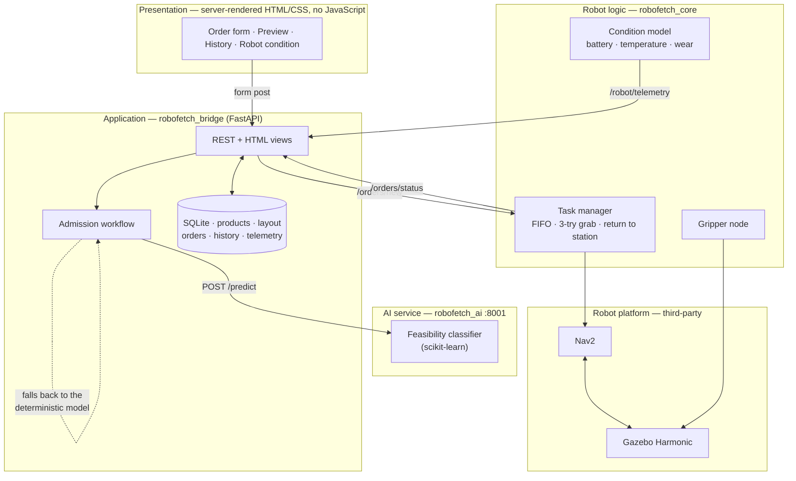
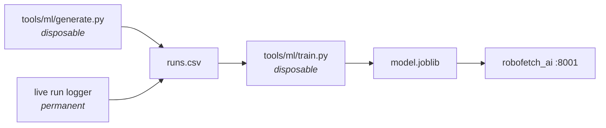

# RoboFetch

A simulated warehouse **pick-and-delivery robot**. A client orders a product by its catalogue
ID; the system looks it up, works out the route, predicts whether the robot can complete the job
in its current condition, and **accepts or refuses** it. If accepted, a differential-drive robot
in Gazebo drives to the shelf, picks the parcel up, carries it to a delivery bay, releases it,
and returns to its charging station.

Built on **ROS 2 Jazzy** and **Gazebo Harmonic**, with a **FastAPI + SQLite** web tier, a
server-rendered UI, and a **scikit-learn** feasibility model.

```
order SKU-3001  →  look up product + route  →  predict cost  →  accept / refuse
                →  navigate  →  grab  →  deliver  →  verify against the simulator
```

---

## Architecture

Five layers. Only the application and robot-logic layers contain our algorithms; navigation,
physics and the ML library are third-party components used as-is.



**The three complex functionalities** (the ones we implement, as opposed to integrate):

1. **Robot condition model and duty cycle** — coupled battery, temperature and wear dynamics
   driven by payload and distance, plus the state machine that sends the robot home to charge
   after two minutes idle. `robofetch_core/robot_model.py`, `robot_state_node.py`.
2. **Order admission and cost preview** — resolve the product, cost the three-leg route, forward-
   simulate the condition model, consult the classifier, then apply policy gates that can
   *overrule* it. `robofetch_bridge/admission.py`.
3. **Physical delivery verification** — confirm the parcel's real simulator pose before marking
   an order complete, because commands returning success is not evidence that anything moved.

---

## Quick start

Requires ROS 2 Jazzy, Gazebo Harmonic, and a Python venv created with `--system-site-packages`.

```bash
cd ~/robofetch_ws && ./scripts/run.sh
```

Starts Gazebo, RViz, Nav2, the robot nodes, the web API on **:8000** and the AI service on
**:8001**. Add `--headless` for no GUI, `--no-build` to skip the build.

Wait for this line before ordering:

```
[task_manager]: Localized and ready - orders submitted now will execute.
```

### Order something

Open **http://localhost:8000** in a browser — pick a product and a destination, see the cost and
the verdict, then confirm. Or from the terminal:

```bash
./scripts/order.sh SKU-3001 delivery_2
```

That prints the admission verdict, follows the order through every state, then checks the
parcel's **real position in Gazebo** against the delivery bay. `./scripts/order.sh --list` shows
the catalogue.

### Stop

```bash
./scripts/stop.sh
```

Always run this before relaunching — leftovers publish a second `/clock` and cause confusing
failures, and a surviving API holds port 8000 while answering from the wrong database.

---

## The warehouse

An 8 × 6 m room. All three shelves are flush against a wall: a gap narrower than ~1.2 m is a trap
a 0.44 m robot cannot turn around in. Two parcels per shelf, ~1 m apart — they are carried on the
floor rather than lifted, so spacing is what keeps them from colliding.

```
 ┌────────────────────────────────────────┐  y=+3
 │▓▓▓▓ shelf_1 ▓▓▓▓      ▓▓▓ shelf_2 ▓▓▓  │
 │   ▪1001   ▪1002        ▪2001  ▪2002    │
 │                                   ▓▓▓▓ │
 │                             ▪3002 ▓ s3 ▓
 │                             ▪3001 ▓    ▓
 │  ◎delivery_1     ⌂station      ◎delivery_2
 └────────────────────────────────────────┘  y=-3
 x=-4                                    x=+4
```

| Entity | Coordinates | | Entity | Coordinates |
|---|---|---|---|---|
| `pick_1a` / `pick_1b` | (−3.0, 0.95) / (−2.0, 0.95) | | `delivery_1` | (−3.0, −2.2) |
| `pick_2a` / `pick_2b` | (1.05, 0.95) / (1.95, 0.95) | | `delivery_2` | (2.6, −2.2) |
| `pick_3a` / `pick_3b` | (2.75, −1.5) / (2.75, −0.5) | | `station_1` | (0.0, −2.2) |

The map frame equals the Gazebo world frame, so every coordinate above is literal.

### Catalogue

| Product | Name | Weight | Shelf | Simulator model |
|---|---|---|---|---|
| `SKU-1001` | Bearing set 6204-ZZ | 1.8 kg | shelf_1 | `parcel_1` |
| `SKU-1002` | Hydraulic seal kit | 0.6 kg | shelf_1 | `parcel_2` |
| `SKU-2001` | Servo drive unit | 3.2 kg | shelf_2 | `parcel_3` |
| `SKU-2002` | Cable harness, 5 m | 1.1 kg | shelf_2 | `parcel_4` |
| `SKU-3001` | Li-ion battery pack, 48 V | 4.5 kg | shelf_3 | `parcel_5` |
| `SKU-3002` | IR sensor module | 0.3 kg | shelf_3 | `parcel_6` |

The weight spread is deliberate: payload drives both energy draw and heating, so it has to be
wide enough for the classifier to key on.

---

## The AI pipeline

One binary classifier: *given the robot's battery, temperature, condition, the payload weight
and the route length, will this order complete within limits?*



The generator and trainer live in `tools/ml/`, **outside the colcon build**, and are meant to be
deleted once the model exists — the running system depends only on `model.joblib`. Both write the
same CSV schema the live logger produces, so real and synthetic runs are interchangeable.

```bash
./robofetch_venv/bin/python tools/ml/generate.py --runs 6000 --out tools/ml/runs.csv
./robofetch_venv/bin/python tools/ml/train.py --data tools/ml/runs.csv \
    --out src/robofetch_ai/robofetch_ai/models/model.joblib
```

Last training run: **CV F1 0.972**, 96% accuracy on a held-out split. Feature importance was
battery 0.67, condition 0.20, distance 0.06, temperature 0.04, payload 0.03.

**Be honest about what this means.** The model learns the generator's assumptions, not real robot
physics. Its purpose is to demonstrate an ML-in-the-loop decision workflow. The system also runs
without it: if the AI service is unreachable, admission falls back to the deterministic energy
formula and records the decision as made by policy alone.

---

## Testing

```bash
# 65 unit + integration tests, no simulator needed, ~4 s
source install/setup.bash
./robofetch_venv/bin/python -m pytest src/robofetch_core/test/ src/robofetch_bridge/test/ -v
```

| Suite | Covers |
|---|---|
| `test_robot_model.py` | energy, thermal and wear relationships and their coupling |
| `test_admission.py` | policy gates, gate ordering, classifier override, AI-down fallback |
| `test_db.py` | catalogue and layout CRUD, order lifecycle, telemetry, analytics |
| `test_api_integration.py` | HTTP ↔ SQLite ↔ ROS seams, refusal path, health |

**Acceptance tests** drive the real system and confirm physical claims against Gazebo:

```bash
./robofetch_venv/bin/python scripts/acceptance.py
```

Needs a freshly launched stack; it checks the parcels are on their shelves and says so if not.
`--quick` skips the two slow physical checks.

### Requirements evidence — last full run, 15/15

| Req | Check | Result |
|---|---|---|
| UC1/UC2 | order by product ID, tracked to completion | order 1, accepted by model |
| UC4 | parcel physically delivered | **0.65 m** from the bay, moved 2.91 m (Gazebo) |
| UC5 | catalogue and layout served from the database | 6 products, 2 destinations |
| UC6 | analytics agree with the orders table | 3/5 completed, 1 refused |
| UC9 | preview returns cost and verdict | 8.6 m, 6.11 Wh, peak 57.5 °C |
| FR5 | unserviceable order refused with a reason | "SKU-1002 is out of stock" |
| FR6 | orders served oldest-first | submitted [3, 4], started [3, 4] |
| FR8 | failing grab retried 3× then failed | failed after 3 attempts, returned to station |
| FR10 | battery, temperature, condition tracked | 67.7%, 50.8 °C, 99.76% |
| FR12 | run logged to CSV for ML | 34 samples |
| NFR1 | preview including the ML call under 2 s | **368 ms** |
| NFR3 | pages render server-side, no JavaScript | all 200, no `<script>` |
| C2 | classifier consulted inside the workflow | `decided_by=model` |

---

## Project structure

| Package | Contents |
|---|---|
| `robofetch_description` | robot URDF/xacro, Gazebo plugins, RViz config |
| `robofetch_gazebo` | `warehouse.sdf`, `bridge.yaml`, sim launch |
| `robofetch_nav` | `nav2_params.yaml`, generated map, navigation launch |
| `robofetch_interfaces` | `Grab.srv` |
| `robofetch_core` | condition model, task manager, gripper node |
| `robofetch_bridge` | FastAPI, SQLite, admission workflow, AI client |
| `robofetch_ai` | feasibility prediction service |
| `robofetch_web` | Jinja2 templates and one stylesheet |
| `robofetch_bringup` | `delivery.launch.py` |
| `tools/ml` | **disposable** data generator and trainer |

---

## Known limitations

Documented rather than hidden — `HANDOVER.md` §7 has the full list.

- **Delivery accuracy is ~0.6–0.8 m.** `DetachableJoint` welds the parcel wherever it lies at
  grab time and releases it at that same offset.
- **Catalogue weight is not the simulated parcel mass.** Parcels stay at 0.2 kg with near-zero
  friction — the setting that took delivery success from 1/3 to 3/3, because a heavier or
  higher-friction parcel dragged and made the controller abort. Catalogue weight drives the
  energy model only.
- **Reliability tracks CPU load.** On a saturated machine, goals abort and localization degrades.
- **Cancelling does not stop the robot** once an order has started.
- **No SLAM.** The map is generated analytically from world geometry.

---

## Documentation

- **`docs/proposal.md`** — the approved project proposal: requirements, functionality
  categorisation, and the algorithms behind the complex features.
- **`docs/diagrams.md`** — UML models: use case, class, sequence, state machine, deployment, ER.
- **`HANDOVER.md`** — the deep reference: every significant problem hit during development and
  how it was solved. Start there if something breaks.
