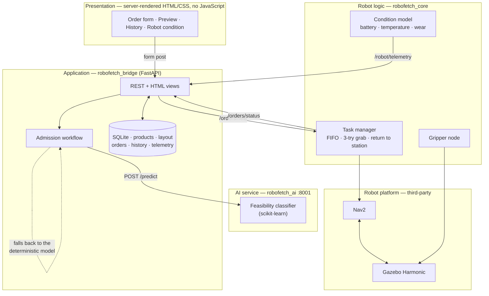
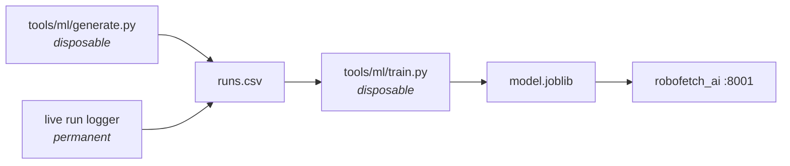

# RoboFetch

A simulated warehouse **pick-and-delivery robot**. A client orders a product by its catalogue
ID; the system looks it up, works out the route, predicts whether the robot can complete the job
in its current condition, and **accepts or refuses** it. If accepted, a differential-drive robot
in Gazebo drives to the shelf, picks the parcel up, carries it to a delivery bay, releases it,
and returns to its charging station.

Built on **ROS 2 Jazzy** and **Gazebo Harmonic**, with a **FastAPI + SQLite** web tier, a
server-rendered UI, and a **scikit-learn** feasibility model.

```
order SKU-3001  →  look up product + route  →  predict cost  →  accept / refuse
                →  navigate  →  grab  →  deliver  →  verify against the simulator
```

---

## Architecture

Five layers. Only the application and robot-logic layers contain our algorithms; navigation,
physics and the ML library are third-party components used as-is.



**The three complex functionalities** (the ones we implement, as opposed to integrate):

1. **Robot condition model and duty cycle** — coupled battery, temperature and wear dynamics
   driven by payload and distance, plus the state machine that sends the robot home to charge
   after two minutes idle. `robofetch_core/robot_model.py`, `robot_state_node.py`.
2. **Order admission and cost preview** — resolve the product, cost the three-leg route, forward-
   simulate the condition model, consult the classifier, then apply policy gates that can
   *overrule* it. `robofetch_bridge/admission.py`.
3. **Physical delivery verification** — confirm the parcel's real simulator pose before marking
   an order complete, because commands returning success is not evidence that anything moved.

---

## Quick start

Requires ROS 2 Jazzy, Gazebo Harmonic, and a Python venv created with `--system-site-packages`.

```bash
cd ~/robofetch_ws && ./scripts/run.sh
```

Starts Gazebo, RViz, Nav2, the robot nodes, the web API on **:8000** and the AI service on
**:8001**. Add `--headless` for no GUI, `--no-build` to skip the build.

Wait for this line before ordering:

```
[task_manager]: Localized and ready - orders submitted now will execute.
```

### Sign in

Open **http://localhost:8000** — the web app requires a login. Two roles are seeded on first run:

| Username | Password | Can do |
|---|---|---|
| `admin` | `admin` | Everything, plus product/delivery-point CRUD and the database browser |
| `controller` | `controller` | Place and track orders, watch the robot, return it to its station, emergency stop |

Change them from the Admin page, or set `ROBOFETCH_ADMIN_PASSWORD` and
`ROBOFETCH_CONTROLLER_PASSWORD` **before the first launch**. The login page warns while a default
is still in use.

### Order something

Open **http://localhost:8000** in a browser — pick a product and a destination, see the cost and
the verdict, then confirm. Or from the terminal:

```bash
./scripts/order.sh SKU-3001 delivery_2
```

That prints the admission verdict, follows the order through every state, then checks the
parcel's **real position in Gazebo** against the delivery bay. `./scripts/order.sh --list` shows
the catalogue.

### Send the robot home

**Return the robot to its station** on the `/robot` or `/orders` page asks for confirmation, then
queues the trip as an order of its own — so it waits for the delivery in progress rather than
abandoning a parcel mid-carry. It is never refused: going home is the one job that leaves a
struggling robot better off. From the terminal:

```bash
curl -X POST http://localhost:8000/api/orders/return
```

### Emergency stop

The red **EMERGENCY STOP** button is in the header of every page. One click, no confirmation —
by the time you have answered "are you sure?" the thing you were worried about has happened.

It cancels the navigation goal, brakes, fails the running order and everything queued — and then
it is finished. There is **nothing to clear afterwards**: no latch, no banner, no state that
outlives the click or your session. The robot is left standing where it stopped, keeping any
parcel it held, and is immediately ready for new work.

It does not drive home. Sending it back is a separate, deliberate press of **Return to station**
— and if it is still holding a parcel, that trip puts the parcel down before moving.

The button sits alone at the far right of the header, with empty space beside it. That gap is
what protects against an accidental press; there is deliberately no "are you sure?" step to slow
down a real one.

```bash
curl -X POST http://localhost:8000/api/estop
```

### Administration

Sign in as `admin` for:

- **Products** — add, update, delete catalogue items
- **Delivery points** — the warehouse destinations
- **Database browser** — read-only view of every table, with hashes and tokens redacted
- **Users** — add accounts, change passwords, assign roles

---

## The web app, page by page

The pages carry no explanatory text — they show data and controls only. This is the reference
for what each one means.

| Page | What it is |
|---|---|
| `/login` | Sign in. Any page you ask for while signed out sends you here and returns you afterwards. |
| `/` | The order form. Only products still on their shelves are offered; the catalogue table below shows everything, including delivered items at stock 0. |
| `/preview` | The cost and the accept/refuse verdict, **before** anything is ordered. Nothing is committed until you confirm. |
| `/orders` | Every order this run, newest first, plus delivery statistics. Refreshes every 2 s. |
| `/robot` | Battery, motor temperature, condition, duty state, payload, distance — the inputs to the accept/refuse decision. Position is deliberately not shown. Refreshes every 2 s. |
| `/return` | Confirms sending the robot to its station, and shows what the trip costs. |
| `/admin` | Table row counts, user management, and links to the pages below. |
| `/admin/products` | Product CRUD. |
| `/admin/delivery-points` | Delivery-point CRUD. |
| `/admin/db` | Read-only browse of every table. |

### Reading the order preview

- **Route** / **Return to station** — metres out, and metres home afterwards.
- **Energy** / **Energy to get home** — the return leg is costed even though the customer never
  sees it, because a job the robot cannot come back from is not a job it can take.
- **Orders already queued** / **Energy reserved** / **Battery at start** — appear only when work
  is already in flight. This order is costed against the battery the robot will have *after*
  that work, so these rows explain why the figure is lower than the one on `/robot`.
- **decided by** — `model` means the classifier was consulted and agreed; `policy` means the
  deterministic gates decided alone (which is also what happens when the AI service is down).

### Editing products

A product is a catalogue entry pointing at **one physical parcel** in the simulator.

- **Simulator model** must be a parcel that exists in `warehouse.sdf` — `parcel_1` … `parcel_6`.
  Anything else sends the robot to the shelf to find nothing, and the order fails after three
  grab attempts.
- **Stock** is really "is the parcel on its shelf?". It drops to 0 on delivery and is restored on
  restart. See *Known limitations* — stock above 1 describes a warehouse that does not exist.
- An existing product ID is updated in place; a new one is created.

### Editing delivery points

Coordinates are in the Gazebo world frame, which equals the map frame, so the numbers are
literal. Keep destinations ~1 m apart and 0.6 m clear of walls and shelves: parcels sit below the
lidar plane, so stacking deliveries on one point creates an obstacle the robot cannot see.

### Looking at the database directly

**phpMyAdmin will not work.** It is a MySQL/MariaDB tool; RoboFetch uses **SQLite**, which is a
single file (`~/robofetch_ws/robofetch.db`) with no server to connect to. The equivalent is
`sqlite-web`, which gives you the same browse-and-query experience in a browser:

```bash
./robofetch_venv/bin/pip install sqlite-web
./robofetch_venv/bin/sqlite_web ~/robofetch_ws/robofetch.db --port 8081
```

Then open **http://localhost:8081**: browse tables, run arbitrary SQL, edit rows, export CSV.
Avoid writing to the database while a delivery is running — it will fight the API for SQLite's
write lock. Command-line alternatives: `sqlite3 ~/robofetch_ws/robofetch.db` (built in), or the
desktop *DB Browser for SQLite* (`sudo apt install sqlitebrowser`).

### Stop

```bash
./scripts/stop.sh
```

Always run this before relaunching — leftovers publish a second `/clock` and cause confusing
failures, and a surviving API holds port 8000 while answering from the wrong database.

---

## The warehouse

An 8 × 6 m room. All three shelves are flush against a wall: a gap narrower than ~1.2 m is a trap
a 0.44 m robot cannot turn around in. Two parcels per shelf, ~1 m apart — they are carried on the
floor rather than lifted, so spacing is what keeps them from colliding.

```
 ┌────────────────────────────────────────┐  y=+3
 │▓▓▓▓ shelf_1 ▓▓▓▓      ▓▓▓ shelf_2 ▓▓▓  │
 │   ▪1001   ▪1002        ▪2001  ▪2002    │
 │                                   ▓▓▓▓ │
 │                             ▪3002 ▓ s3 ▓
 │                             ▪3001 ▓    ▓
 │  ◎delivery_1     ⌂station      ◎delivery_2
 └────────────────────────────────────────┘  y=-3
 x=-4                                    x=+4
```

| Entity | Coordinates | | Entity | Coordinates |
|---|---|---|---|---|
| `pick_1a` / `pick_1b` | (−3.0, 0.95) / (−2.0, 0.95) | | `delivery_1` | (−3.0, −2.2) |
| `pick_2a` / `pick_2b` | (1.05, 0.95) / (1.95, 0.95) | | `delivery_2` | (2.6, −2.2) |
| `pick_3a` / `pick_3b` | (2.75, −1.5) / (2.75, −0.5) | | `station_1` | (0.0, −2.2) |

The map frame equals the Gazebo world frame, so every coordinate above is literal.

### Catalogue

| Product | Name | Weight | Shelf | Simulator model |
|---|---|---|---|---|
| `SKU-1001` | Bearing set 6204-ZZ | 1.8 kg | shelf_1 | `parcel_1` |
| `SKU-1002` | Hydraulic seal kit | 0.6 kg | shelf_1 | `parcel_2` |
| `SKU-2001` | Servo drive unit | 3.2 kg | shelf_2 | `parcel_3` |
| `SKU-2002` | Cable harness, 5 m | 1.1 kg | shelf_2 | `parcel_4` |
| `SKU-3001` | Li-ion battery pack, 48 V | 4.5 kg | shelf_3 | `parcel_5` |
| `SKU-3002` | IR sensor module | 0.3 kg | shelf_3 | `parcel_6` |

The weight spread is deliberate: payload drives both energy draw and heating, so it has to be
wide enough for the classifier to key on.

---

## The AI pipeline

One binary classifier: *given the robot's battery, temperature, condition, the payload weight
and the route length, will this order complete within limits?*



The generator and trainer live in `tools/ml/`, **outside the colcon build**, and are meant to be
deleted once the model exists — the running system depends only on `model.joblib`. Both write the
same CSV schema the live logger produces, so real and synthetic runs are interchangeable.

```bash
./robofetch_venv/bin/python tools/ml/generate.py --runs 6000 --out tools/ml/runs.csv
./robofetch_venv/bin/python tools/ml/train.py --data tools/ml/runs.csv \
    --out src/robofetch_ai/robofetch_ai/models/model.joblib
```

Last training run: **CV F1 0.972**, 96% accuracy on a held-out split. Feature importance was
battery 0.67, condition 0.20, distance 0.06, temperature 0.04, payload 0.03.

**Be honest about what this means.** The model learns the generator's assumptions, not real robot
physics. Its purpose is to demonstrate an ML-in-the-loop decision workflow. The system also runs
without it: if the AI service is unreachable, admission falls back to the deterministic energy
formula and records the decision as made by policy alone.

---

## Testing

```bash
# 23 test cases from 16 functions, no simulator needed, ~10 s
source install/setup.bash
./robofetch_venv/bin/python -m pytest src/robofetch_core/test/ src/robofetch_bridge/test/ -v
```

| Suite | Covers |
|---|---|
| `test_robot_model.py` | energy, thermal and wear relationships and their coupling |
| `test_admission.py` | policy gates, gate ordering, classifier override, AI-down fallback |
| `test_db.py` | order ordering, stock consumption, password salting, the browser's injection defence and redaction |
| `test_auth.py` | the login gate on every protected page, and that the pages carry no advice |
| `test_api_integration.py` | HTTP ↔ SQLite ↔ ROS seams |

This is a deliberately **small representative set**, not an exhaustive suite — the acceptance
tests below carry the weight, because they exercise the real robot rather than a fake one.

**Acceptance tests** drive the real system and confirm physical claims against Gazebo:

```bash
./robofetch_venv/bin/python scripts/acceptance.py
```

Needs a freshly launched stack; it checks the parcels are on their shelves and says so if not.
`--quick` skips the two slow physical checks.

### Requirements evidence — last full run, 26/26

| Req | Check | Result |
|---|---|---|
| UC1/UC2 | order by product ID, tracked to completion | order 1, accepted by model |
| UC4 | parcel physically delivered | **0.44 m** from the bay, moved 3.23 m (Gazebo) |
| UC5 | catalogue and layout served from the database | 6 products, 2 destinations |
| UC6 | analytics agree with the orders table | 3/6 completed, 2 refused, rate 0.75 |
| UC9 | preview returns cost and verdict | 8.6 m, 6.11 Wh, peak 56.8 °C |
| FR3 | delivered product no longer orderable | 5 of 6 orderable; re-order refused "out of stock" |
| FR5 | unserviceable order refused with a reason | "SKU-1002 is out of stock" |
| FR6 | orders served oldest-first | submitted [4, 5], started [4, 5] |
| FR8 | failing grab retried 3× then failed | failed after 3 attempts, returned to station |
| FR10 | battery, temperature, condition tracked | 85.2%, 51.2 °C, 99.97% |
| FR11 | idle robot returns to its station and recharges | docked, then 87.3% → 100.0% |
| FR12 | run logged to CSV for ML | 35 samples |
| NFR1 | preview including the ML call under 2 s | **400 ms** |
| NFR3 | pages render server-side, no JavaScript | all 200, no `<script>` |
| C2 | classifier consulted inside the workflow | `decided_by=model` |
| C2 | in-flight work reserved against the next decision | robot at 100%, next order costed from **78.4%** (1 order holding 4.76 Wh) |
| C2 | reservation released when the order finishes | 0 reserved after order 1 ended |

---

## Project structure

| Package | Contents |
|---|---|
| `robofetch_description` | robot URDF/xacro, Gazebo plugins, RViz config |
| `robofetch_gazebo` | `warehouse.sdf`, `bridge.yaml`, sim launch |
| `robofetch_nav` | `nav2_params.yaml`, generated map, navigation launch |
| `robofetch_interfaces` | `Grab.srv` |
| `robofetch_core` | condition model, task manager, gripper node |
| `robofetch_bridge` | FastAPI, SQLite, admission workflow, AI client |
| `robofetch_ai` | feasibility prediction service |
| `robofetch_web` | Jinja2 templates and one stylesheet |
| `robofetch_bringup` | `delivery.launch.py` |
| `tools/ml` | **disposable** data generator and trainer |

---

## Known limitations

Documented rather than hidden — `HANDOVER.md` §7 has the full list.

- **Delivery accuracy is ~0.25–0.35 m.** `DetachableJoint` still welds the parcel wherever it
  lies at grab time and releases it at that same offset, so the residual error is whatever gap
  the robot parks at plus Nav2's goal tolerance. It used to be 0.6–0.8 m, because the robot
  parked without facing the parcel and the gripper accepted anything within 0.85 m in any
  direction — the drop inherited an error created at grab time.
- **Catalogue weight is not the simulated parcel mass.** Parcels stay at 0.2 kg with near-zero
  friction — the setting that took delivery success from 1/3 to 3/3, because a heavier or
  higher-friction parcel dragged and made the controller abort. Catalogue weight drives the
  energy model only.
- **Reliability tracks CPU load.** On a saturated machine, goals abort and localization degrades.
- **Cancelling an order does not stop the robot** once it has started — use the emergency stop,
  which does (it cancels the Nav2 goal and brakes).
- **No SLAM.** The map is generated analytically from world geometry.
- **Only the HTML pages require a login.** The REST API is deliberately open: the acceptance
  suite and the helper scripts in `scripts/` are unauthenticated clients, and this is a
  single-user simulator on one machine. Facing a network, `/api/*` would need the same session
  check and every script would need a token.
- **The robot pushes parcels it has already delivered.** The station and both delivery bays sit
  on the line y = −2.2, and parcels are below the lidar plane, so driving home shoves the parcel
  just dropped. `HANDOVER.md` §0 lists three candidate fixes.

---

## Documentation

- **`docs/proposal.md`** — the approved project proposal: requirements, functionality
  categorisation, and the algorithms behind the complex features.
- **`docs/diagrams.md`** — UML models: use case, class, sequence, state machine, deployment, ER.
- **`HANDOVER.md`** — the deep reference: every significant problem hit during development and
  how it was solved. Start there if something breaks.
