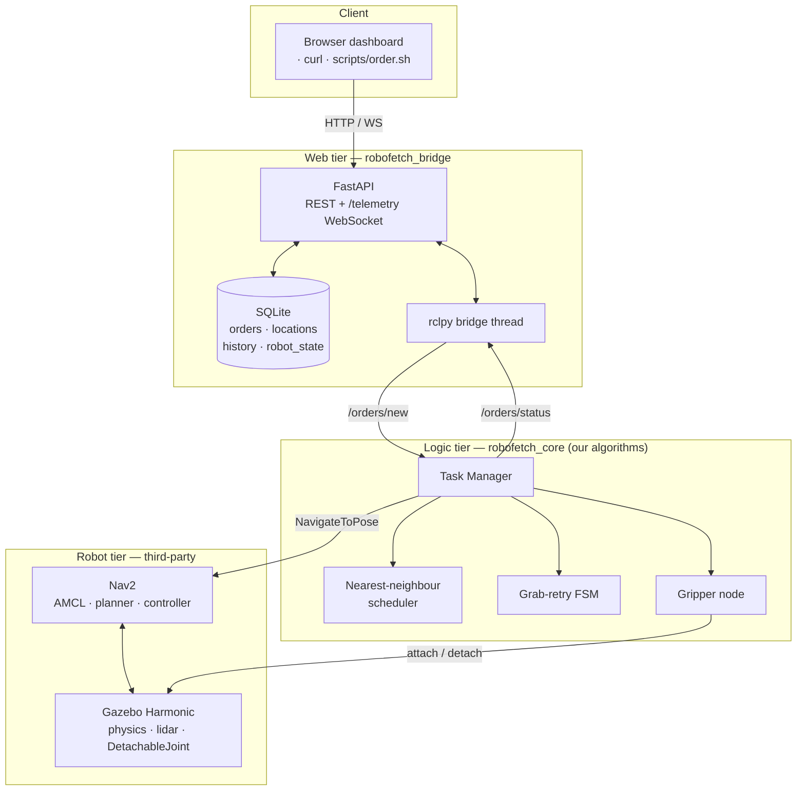

# RoboFetch

A simulated **pick-and-delivery robot**. You send an HTTP request — *bring `item_1` from
`shelf_1` to `delivery_1`* — and a differential-drive robot in Gazebo autonomously navigates a
warehouse, picks the parcel up, carries it to the delivery station, drops it, and reports back.

Built on **ROS 2 Jazzy** and **Gazebo Harmonic**, with a **FastAPI + SQLite** web tier and a
browser dashboard.

```
POST /orders  →  SQLite  →  ROS topic  →  scheduler  →  Nav2  →  gripper  →  status back to SQLite
```

---

## Architecture

Three tiers, as the project proposal specifies. Only the middle tier is our own robotics logic —
navigation and physics are third-party components used as-is.



**Two pieces of non-trivial logic** (the proposal's "complex functionality" requirement):

1. **Nearest-neighbour scheduler** (`robofetch_core/scheduler.py`) — whenever the robot is idle it
   serves the pending order whose pickup is closest to where the robot *actually* ended up, rather
   than following submission order. Re-evaluated after every delivery, so newly arriving orders are
   considered automatically.
2. **Grab-verification and retry FSM** (`robofetch_core/retry.py`) — a grab is confirmed against the
   simulator's own joint state, and a failure backs off, re-approaches the pickup point and retries
   up to three times before failing the order and moving on.

---

## Quick start

Requires ROS 2 Jazzy, Gazebo Harmonic and a Python venv created with `--system-site-packages`
(so `rclpy` and FastAPI are importable in one process).

```bash
cd ~/robofetch_ws && ./scripts/run.sh
```

That stops leftovers, sources ROS, builds, and launches Gazebo, RViz, Nav2, the robot nodes and the
API. Add `--headless` for no GUI, `--no-build` to skip the build.

Wait for this line before ordering:

```
[task_manager]: Localized and ready - orders submitted now will execute.
```

### Order a delivery

```bash
./scripts/order.sh item_1 shelf_1 delivery_1
```

This checks the things that actually go wrong *before* submitting, streams every state change, then
verifies the parcel's **real position in Gazebo** against the drop-off. `item_N` starts on `shelf_N`.

### Dashboard

Open **http://localhost:8000** — order form, live order table, statistics, and a warehouse map. It
runs in the Windows browser under WSL, which sidesteps WSLg entirely.

The map draws parcels from their **real simulator poses**, not from order status, so a parcel that
never actually moved is visibly still on its shelf regardless of what the status says.

### Stop

```bash
./scripts/stop.sh
```

Always run this before relaunching — leftover processes publish a second `/clock` and cause
confusing, hard-to-diagnose failures.

---

## The warehouse

An 8 × 6 m room. Rectangular on purpose: a square room looks identical to a lidar under 90° rotation,
which makes AMCL jump between poses. All three shelves are flush against a wall, because a gap
narrower than ~1.2 m is a trap a 0.44 m robot cannot turn around in.

```
 ┌──────────────────────────────────────┐  y=+3
 │▓▓▓ shelf_1 ▓▓▓▓      ▓▓ shelf_2 ▓▓▓  │  ← both flush to the north wall
 │     ▪item_1              ▪item_2     │
 │                                 ▓▓▓▓ │
 │                                 ▓ s3 ▓ ← flush to the east wall
 │                            ▪item_3 ▓ │
 │ ┌──────────┐                    ▓▓▓▓ │
 │ │ delivery │ ← robot starts here      │
 │ └──────────┘                         │
 └──────────────────────────────────────┘  y=-3
 x=-4                                  x=+4
```

The map frame equals the Gazebo world frame, so every waypoint below is a literal world coordinate.

| Waypoint | Coordinates | | Waypoint | Coordinates |
|---|---|---|---|---|
| `shelf_1` | (−2.5, 0.95) | | `delivery_1` | (−3.1, −2.2) |
| `shelf_2` | (1.5, 0.95) | | `delivery_2` | (−2.1, −2.2) |
| `shelf_3` | (2.75, −1.0) | | `delivery_3` | (−2.6, −1.5) |

Drop-off points are deliberately spread apart: parcels are 0.09 m cubes, *below* the 0.13 m lidar, so
a delivered parcel is invisible to Nav2 and stacking them creates obstacles the robot cannot see.

---

## Testing

Three layers, in increasing cost and decreasing determinism.

```bash
# 63 unit + integration tests — no simulator needed, runs in ~4 s
source install/setup.bash
./robofetch_venv/bin/python -m pytest src/robofetch_core/test/ src/robofetch_bridge/test/ -v
```

| Suite | Count | Covers |
|---|---|---|
| `test_scheduler.py` | 15 | nearest-neighbour selection, distance, queue filtering |
| `test_retry.py` | 19 | retry decisions, backoff, state transitions |
| `test_db.py` | 16 | CRUD, cancellation rules, analytics |
| `test_api_integration.py` | 13 | HTTP ↔ SQLite ↔ ROS seams, WebSocket, health |

**Acceptance tests** drive the real system and confirm every physical claim against Gazebo:

```bash
./robofetch_venv/bin/python scripts/acceptance.py
```

Needs a freshly launched stack (it checks the parcels are on their shelves and tells you if not).
Takes ~15 minutes; `--quick` skips the two slow checks. `--json FILE` writes machine-readable results.

### Requirements evidence

Last full run — 10/10 passed:

| Requirement | Check | Result |
|---|---|---|
| UC1 | order submitted over HTTP | order created, `pending` |
| UC2 | order tracked to a terminal state | → `completed` |
| UC3 | scheduler serves nearest pickup first | submitted `[item_3, item_1]`, served `item_1` first |
| UC4 | parcel physically delivered | **0.59 m** from target, moved 3.05 m (Gazebo) |
| UC5 | waypoint registry CRUD | create/list/delete all pass |
| UC6 | analytics agree with orders table | 14/19 reported, 14/19 counted |
| FR4 | failing grab retried 3× then fails | failed after exactly 3 attempts |
| NFR1 | client sees updates within 1 s | **10 ms** |
| NFR2 | 20 orders scheduled under 100 ms | **0.016 ms** |

---

## Project structure

| Package | Contents |
|---|---|
| `robofetch_description` | robot URDF/xacro, Gazebo plugins, RViz config |
| `robofetch_gazebo` | `warehouse.sdf`, `bridge.yaml` (gz↔ROS), sim launch |
| `robofetch_nav` | `nav2_params.yaml`, generated map, navigation launch |
| `robofetch_interfaces` | `Grab.srv` |
| `robofetch_core` | **our logic** — task manager, scheduler, retry FSM, gripper node |
| `robofetch_bridge` | **web tier** — FastAPI, SQLite, rclpy bridge |
| `robofetch_web` | dashboard (HTML/CSS/JS, no build step) |
| `robofetch_bringup` | `delivery.launch.py` — starts everything |

### Scripts

| Script | Purpose |
|---|---|
| `run.sh` | cold start: stop, build, source, launch |
| `stop.sh` | stop every simulation process **and** the web API |
| `order.sh` | submit an order, follow it, verify against Gazebo |
| `acceptance.py` | full acceptance suite |
| `goto.sh` / `gripper.sh` / `teleop.sh` / `set_pose.sh` | manual control |
| `generate_map.py` | regenerate the map after any world geometry change |

---

## Known limitations

Documented honestly rather than hidden — see `HANDOVER.md` §7 for the full list.

- **Delivery accuracy is ~0.6–0.8 m.** `DetachableJoint` welds the parcel wherever it happens to lie
  at grab time (often ~0.5 m off-centre) and releases it at that same offset. Nav2's 0.25 m parking
  tolerance is a secondary contributor.
- **Reliability varies with CPU load.** On a saturated machine, goals abort and localization degrades.
  This is a simulator-performance limit, not a logic error.
- **Cancelling does not stop the robot.** `DELETE /orders/{id}` marks the order cancelled in SQLite,
  but it was already handed to the robot, which finishes it and overwrites the status.
- **No SLAM.** The map is generated analytically from world geometry, which the proposal permits
  (it specifies a known map; SLAM is listed as a future extension).

---

## Documentation

**`HANDOVER.md`** is the deep reference: full architecture, every significant problem hit during
development and how it was solved, and the reasoning behind each design decision. Start there if
something breaks — most failures seen in this project have already been diagnosed and written up.

`docs/diagrams.md` contains the UML models: use case, class, sequence, state machine and deployment.
