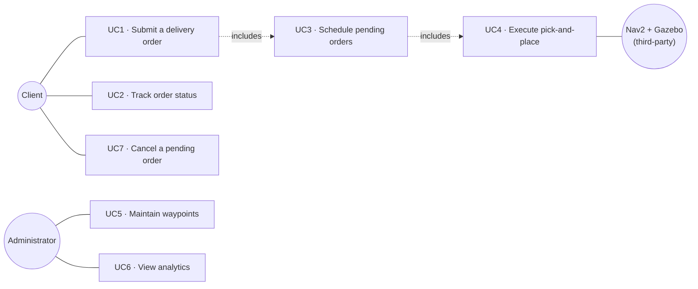
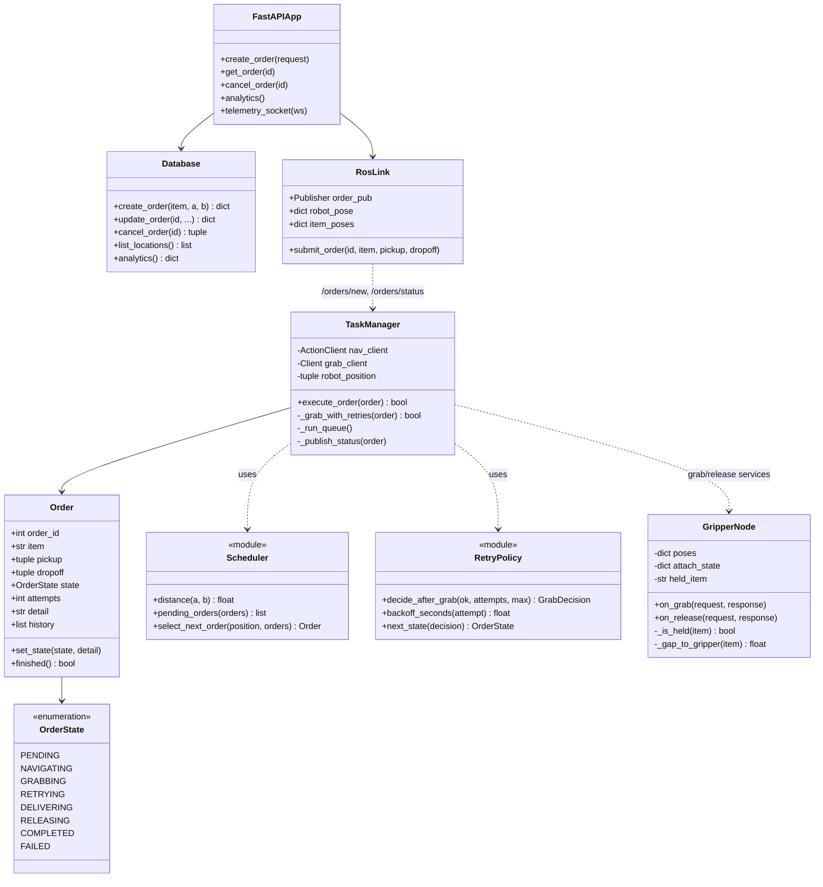
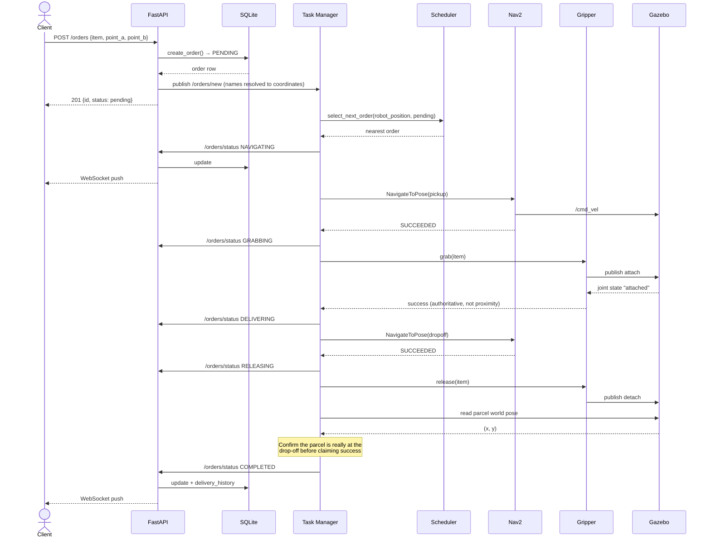
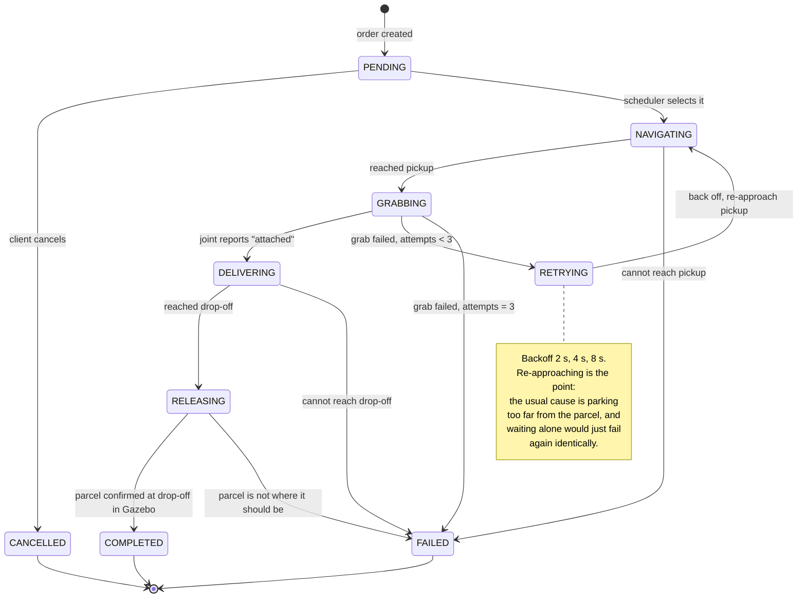
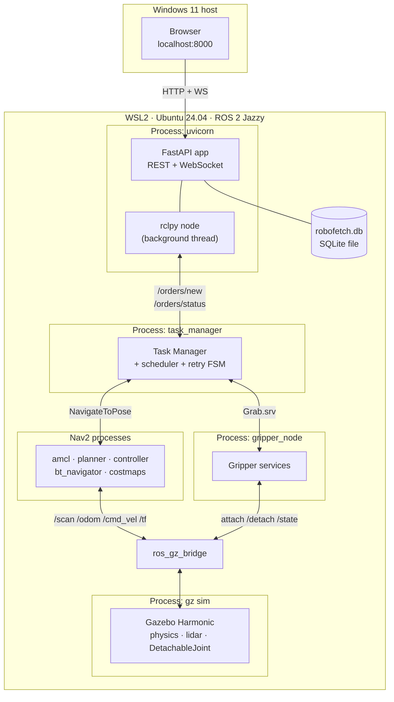
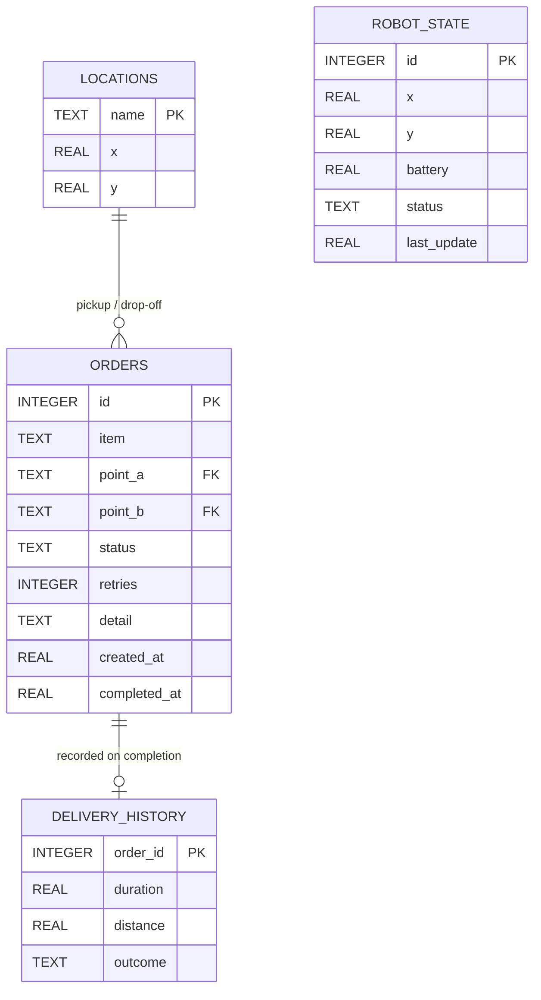

# RoboFetch — UML models

Diagrams for the project report. All are Mermaid, so they render on GitHub and stay editable as
text rather than being screenshots that drift out of date.

---

## 1. Use case diagram

Two actors. The **Client** submits and tracks deliveries; the **Administrator** maintains the
waypoint registry and reads statistics. Nav2 and Gazebo appear as a supporting system actor because
the proposal treats them as third-party services rather than parts we implement.

---

## 2. Class diagram

The logic tier is deliberately free of ROS imports where possible: `Order`, `scheduler` and `retry`
are plain Python, which is what makes them unit-testable without a simulator.

---

## 3. Sequence diagram — a delivery end to end

The path an order takes from HTTP request to a parcel physically on the delivery station.

---

## 4. State machine — order lifecycle and the retry FSM

The shaded cycle is the grab-retry state machine (proposal "complex functionality" #2, FR4).

---

## 5. Deployment / component diagram

Everything runs on one WSL2 host. The browser is the only component outside it — which is
deliberate, because serving the dashboard over HTTP sidesteps WSLg's GUI problems entirely.

---

## 6. Database schema

