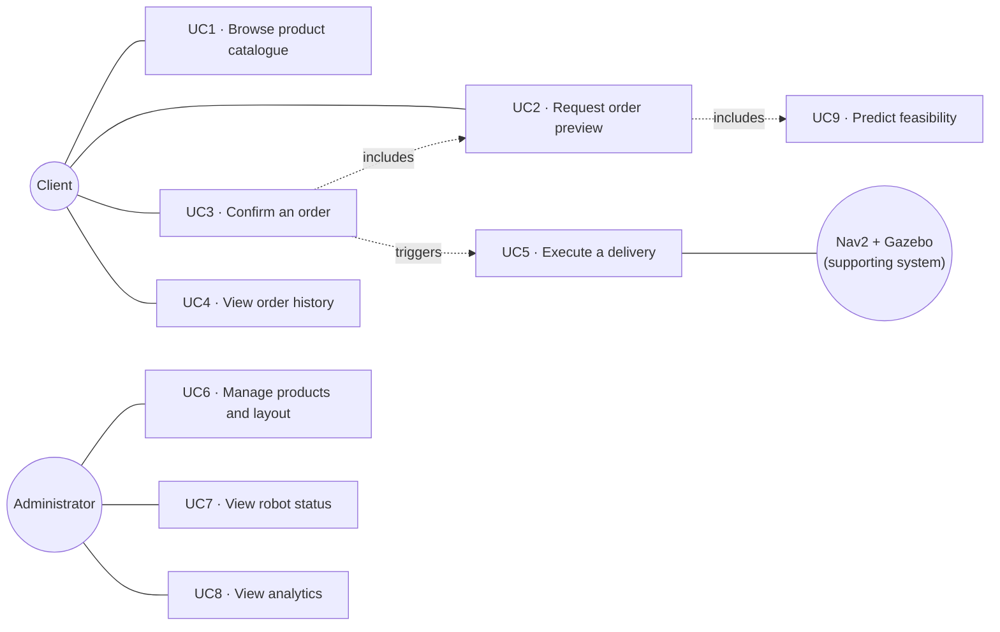
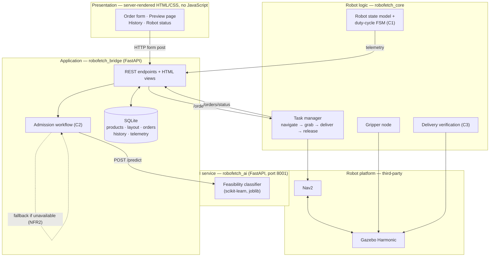
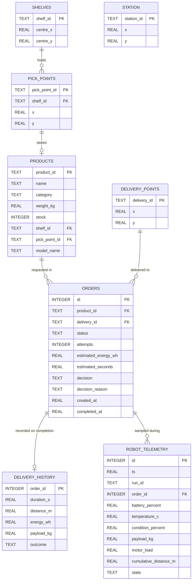
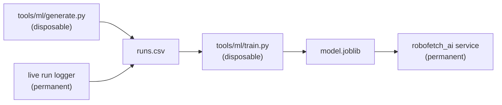
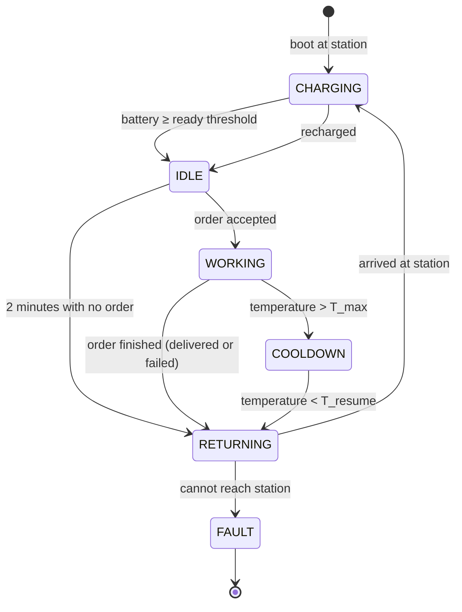
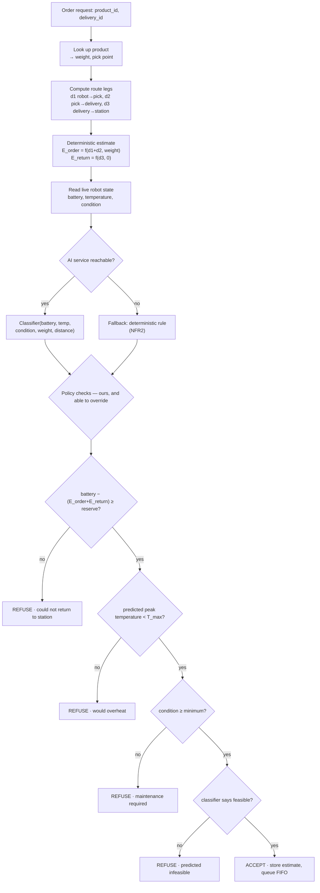
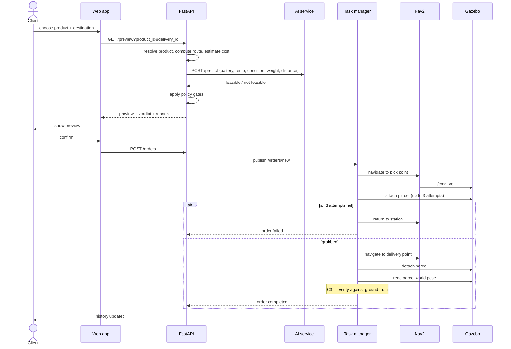

# RoboFetch v2 — Project Proposal

**Software Engineering project · proposal for approval before implementation**

A simulated warehouse **pick-and-delivery robot**. A client orders a product by its catalogue ID
through a web application; the system looks the product up, works out the route, predicts whether
the robot can physically complete the job in its current condition, and either **accepts or refuses**
the order. If accepted, a differential-drive robot in Gazebo navigates to the shelf, picks the
parcel up, carries it to a delivery point, releases it, and returns to its charging station.

Version 1 (navigation, gripper, orders, REST API) is already implemented and verified. This
document proposes **version 2**, whose purpose is to make the system realistic and data-driven:
a real product database, robot health telemetry, and an ML-based admission decision.

---

## 1. Vision and scope

The v1 system could execute a delivery. It could not answer the question a real warehouse
operator actually asks: **"can the robot do this job right now, and what will it cost?"**

v2 answers that. Every order is evaluated against the robot's live battery, temperature and
mechanical condition, together with the weight of the requested product and the distance it must
travel. A machine-learning classifier — trained on logged run data — makes the accept/refuse call
inside a decision workflow we implement ourselves.

### 1.1 What changes from v1

| Area | v1 | v2 |
|---|---|---|
| Ordering | `item_1`, `item_2`, `item_3` string names | **product catalogue IDs** (`SKU-1001`, …) |
| Locations | hardcoded waypoint list in code | **warehouse database**: shelves, pick points, delivery points, station |
| Web app | JS dashboard with live map + WebSocket | **server-rendered HTML/CSS**, no JavaScript, no map |
| Robot state | position only | **battery, temperature, condition, payload, load, wear** |
| Order acceptance | always accepted | **predicted feasibility → accept or refuse**, with a cost preview |
| Data | none retained for analysis | **per-run CSV logs** feeding an ML training set |
| Scheduling | nearest-neighbour selection | **FIFO by order time** |
| Grab failure | retry state machine with backoff | **3 attempts, then fail and return to station** |
| Idle behaviour | robot stops wherever it is | **after 2 minutes idle, return to station and charge** |

**Deliberately removed.** The live robot map and pose telemetry are removed from the web
application: the operator's job is to place orders and review history, not to watch the robot move.
The nearest-neighbour scheduler is removed because delivery order should follow the order in which
customers actually ordered, not geographic convenience. The retry state machine is replaced by a
plain three-attempt loop, because its complexity was not justified by the behaviour it produced.

---

## 2. Requirements

Requirements are fixed up front, as the waterfall process this project follows requires
(§12). Each is traceable to a design element and to a test.

### 2.1 Functional requirements

| ID | Requirement |
|---|---|
| FR1 | The system shall maintain a catalogue of products, each with a unique ID, name, category, weight and storage location. |
| FR2 | The system shall maintain a warehouse layout: shelves, per-product pick points, delivery points and one robot station. |
| FR3 | A client shall submit an order by product ID and destination, without knowing any coordinates. |
| FR4 | The system shall present an **order preview** before confirmation: product details, route distance, estimated energy and time cost, and the accept/refuse verdict. |
| FR5 | The system shall **refuse** an order it predicts the robot cannot complete, stating a human-readable reason. |
| FR6 | Accepted orders shall be executed in the order they were placed (FIFO). |
| FR7 | The robot shall navigate to the pick point, grab the parcel, carry it to the delivery point and release it. |
| FR8 | A failed grab shall be retried up to **3 times**; after the third failure the order fails and the robot returns to its station. |
| FR9 | The system shall confirm a delivery against the parcel's **real position in the simulator** before marking the order complete. |
| FR10 | The system shall continuously track robot battery, temperature, condition, payload and cumulative distance. |
| FR11 | After **2 minutes** with no pending order, the robot shall return to its station and recharge. |
| FR12 | Every run shall be logged to a CSV file suitable for machine-learning training. |
| FR13 | A client shall view the history of all orders and their outcomes. |
| FR14 | An administrator shall create, read, update and delete products and layout entries. |
| FR15 | The system shall report aggregate statistics: success rate, mean delivery time, energy per delivery, uptime. |

### 2.2 Non-functional requirements

| ID | Requirement |
|---|---|
| NFR1 | The order preview, including the ML prediction, shall be returned within **2 seconds**. |
| NFR2 | The system shall remain operable if the AI service is unavailable, falling back to a deterministic feasibility rule. |
| NFR3 | The web application shall require no JavaScript and work in any browser. |
| NFR4 | Robot telemetry shall be persisted at least once per second while the robot is active. |
| NFR5 | All reported deliveries shall be verifiable against simulator ground truth. |
| NFR6 | The ML training pipeline shall be removable without affecting the running system. |

---

## 3. Functionality categorisation

This is the section the assessment asks for: every functionality assigned to one of the three
categories, with a motivation for the assignment.

### 3.1 Category A — Data / repository / CRUD / formulae

Straightforward persistence and arithmetic. No novel algorithms; the engineering value is in the
schema design and in keeping the data model honest.

| # | Functionality | Motivation for this category |
|---|---|---|
| A1 | **Product catalogue CRUD** — id, name, category, weight, stock, shelf, pick point, simulator model name | Plain table-backed create/read/update/delete. |
| A2 | **Warehouse layout registry CRUD** — shelves, pick points, delivery points, station | Same; replaces coordinates previously hardcoded in source. |
| A3 | **Order lifecycle CRUD** — create, read, list, cancel, status transitions | Standard record management. |
| A4 | **Order preview resolution** — product ID → pick point → route → distance | A lookup and a distance sum; no decision-making. |
| A5 | **Delivery history** — duration, distance, energy, payload, outcome per order | Append-and-query. |
| A6 | **Robot telemetry time-series** — battery, temperature, condition, load, payload | Periodic inserts. |
| A7 | **Per-run CSV export** — one file per run, ML-ready schema | Serialisation of A6. |
| A8 | **KPI formulae** — success rate, mean delivery time, Wh per kg·m, uptime | Aggregate SQL and simple arithmetic. |
| A9 | **Deterministic energy/cost estimate** — closed-form formula (§10.2) | An explicit formula, not a learned or searched result. It is also the NFR2 fallback. |

### 3.2 Category B — Third-party services

Components we integrate and configure but do not implement. Substantial engineering effort goes
into *using* them correctly; none of the logic inside them is ours.

| # | Service | Role | Motivation for this category |
|---|---|---|---|
| B1 | **Nav2** | AMCL localization, global planner, controller, behaviour tree | Complete off-the-shelf navigation stack; we supply parameters, a map and goals. |
| B2 | **Gazebo Harmonic** | Physics, lidar sensor, `DetachableJoint`, pose publishing | Simulator used as-is. |
| B3 | **FastAPI + uvicorn** | REST API and HTML rendering | Web framework. |
| B4 | **SQLite** | Persistence engine | Database engine. |
| B5 | **scikit-learn** | The feasibility classifier | A library implementation of a standard algorithm. Note the classifier *by itself* is a third-party service — see §3.3 C2 for what makes its use non-trivial. |
| B6 | **pandas / NumPy** | Dataset assembly and feature preparation | Standard data tooling. |
| B7 | **joblib** | Model serialisation | Persistence utility. |
| B8 | **ros_gz_bridge, robot_state_publisher, xacro** | ROS↔Gazebo transport, TF, URDF processing | ROS ecosystem tooling. |

### 3.3 Category C — Complex functionalities implemented by us

These carry the application logic. Each is described algorithmically in §11, as required.

#### C1 · Robot state model and duty-cycle state machine

A coupled dynamic model of the robot's physical condition, plus the policy that governs when it
may work.

Three quantities evolve together and influence each other: **energy draw** rises with payload mass
and speed; **temperature** rises with motor load and payload and decays toward ambient; **condition**
(wear) degrades with accumulated energy and with time spent above a temperature threshold, and
degraded condition in turn raises energy draw. That mutual coupling is what makes it a model rather
than three counters.

On top of it sits a state machine — `idle → working → returning → charging → cooldown → fault` —
enforcing operational policy: the robot returns to its station after two minutes idle, refuses to
depart without enough charge to get back, and enters cooldown when it overheats.

**Motivation:** entirely our own design. There is no library that models this robot; the dynamics,
the coupling and the policy are all specified and implemented by us, and the behaviour is described
by a state diagram and difference equations (§11.1).

#### C2 · Order admission and cost-preview workflow

The decision procedure that turns "a customer wants SKU-3001" into "accepted, ~18 Wh, ~95 s" or
"refused, battery would fall below the reserve needed to return to the station".

The steps: resolve the product to its pick point; compute the three-leg route (current position →
pick point → delivery point, plus the return leg to the station); apply the deterministic energy
formula to each leg; assemble a feature vector from the *live* robot state and the product weight;
call the classifier; then apply our own decision policy — charge reserve, thermal headroom,
condition floor — and combine that with the classifier's verdict into a final decision with a reason
the operator can read.

**Motivation, stated explicitly because the assessment brief singles this out:** a pretrained or
library classifier on its own is a third-party service, and we have listed it as such (B5). What is
ours is the workflow *around* it. The model does not see an order; it sees a feature vector we
construct from live telemetry, catalogue data and a route we compute. Its output is not the answer;
it is one input to a policy that can override it — a classifier that says "yes" is still refused if
the robot could not physically get home afterwards. The system also degrades gracefully to the
deterministic rule when the model is unavailable (NFR2). The decision logic, the feature
construction, the route computation and the override policy are all implemented by us and are
described as an activity diagram in §11.2.

#### C3 · Physical delivery verification

Before an order is marked complete, the parcel's **actual pose in the simulator** is compared with
the delivery point. If they disagree the order is failed, whatever the commands reported.

**Motivation:** this is not a status check but a cross-validation between two independent sources of
truth — the command pipeline and the physics engine. It exists because during v1 development the
system reported "3/3 delivered" while no parcel had moved: every command had returned success and
every downstream signal agreed with the error. The verification logic, and the decision about what
evidence is admissible, are ours.

### 3.4 Balance self-assessment

| Category | Count | Assessment |
|---|---|---|
| A · Data / CRUD / formulae | 9 | Well covered. A real relational model with four related entities, full CRUD, and derived statistics. |
| B · Third-party services | 8 | Well covered, and genuinely diverse: a robotics stack, a physics simulator, a web framework, a database and an ML library. |
| C · Complex functionalities | 3 | **The weakest category, and we state that openly.** |

**Honest assessment of the imbalance.** An earlier version of this project carried two additional
complex functionalities — a nearest-neighbour delivery scheduler and a grab-retry state machine with
exponential backoff. Both have been deliberately removed: the scheduler because orders should be
served in the sequence customers placed them, not by geographic proximity, and the retry machine
because its complexity was not repaid by its behaviour. Removing features that do not earn their
keep is the right engineering decision, but it does leave category C carrying three items.

We judge the proposal acceptable because the remaining complex work is substantial rather than
numerous: C1 is a coupled dynamic model with an operational policy, and C2 is a multi-step decision
workflow that wraps a machine-learning model in logic that can overrule it. Both are algorithmically
describable and both are unambiguously ours. **If the assessor considers three insufficient, the
natural additions would be** (a) reinstating an order-queue algorithm that sequences by predicted
energy cost and thermal headroom rather than proximity, or (b) a predictive-deferral feature that,
when an order is refused, computes the earliest future time at which it becomes feasible after
charging and cooling. We would welcome direction on whether either is required.

---

## 4. Actors and use cases



---

## 5. Architecture

Five layers. Only the robot-logic and application layers contain our algorithms.



**Fallback path.** If the AI service does not answer within the NFR1 budget, admission falls back to
the deterministic energy formula (A9) and records that the decision was made without the model. The
system never blocks on the AI.

---

## 6. Data model



The v1 `locations` table is replaced: coordinates now live in `shelves`, `pick_points`,
`delivery_points` and `station`, and an order references a **product**, never a coordinate.

---

## 7. Warehouse layout

The room stays 8 × 6 m. All three shelves remain flush against a wall — a gap narrower than about
1.2 m is a trap a 0.44 m robot cannot turn around in, and that failure has already cost this project
once. Every waypoint below keeps at least 0.6 m clearance from walls and shelves (robot radius
0.22 m plus 0.35 m costmap inflation).

```
 ┌────────────────────────────────────────┐  y=+3
 │▓▓▓▓ shelf_1 ▓▓▓▓      ▓▓▓ shelf_2 ▓▓▓  │
 │   ▪1001   ▪1002        ▪2001  ▪2002    │
 │                                   ▓▓▓▓ │
 │                             ▪3002 ▓ s3 ▓
 │                             ▪3001 ▓    ▓
 │                                   ▓▓▓▓ │
 │  ◎delivery_1      ⌂station      ◎delivery_2
 └────────────────────────────────────────┘  y=-3
 x=-4                                    x=+4
```

| Entity | Coordinates | Note |
|---|---|---|
| `pick_1a` / `pick_1b` | (−3.0, 0.95) / (−2.0, 0.95) | shelf_1, 1.0 m apart |
| `pick_2a` / `pick_2b` | (1.05, 0.95) / (1.95, 0.95) | shelf_2, 0.9 m apart |
| `pick_3a` / `pick_3b` | (2.75, −1.5) / (2.75, −0.5) | shelf_3, 1.0 m apart |
| `delivery_1` | (−3.0, −2.2) | south-west corner |
| `delivery_2` | (2.6, −2.2) | south-east corner, 5.6 m from delivery_1 |
| `station_1` | (0.0, −2.2) | robot spawn, home and charging point |

**Parcel spacing instead of lifting.** Parcels stay on the floor and are attached where they lie.
The two parcels on each shelf are placed ~1 m apart so the robot can reach either without touching
the other. Lifting a carried parcel was considered and rejected: parcels are 0.09 m cubes kept
deliberately below the 0.13 m lidar so a carried one is never mistaken for an obstacle, and raising
one into the laser plane would make the robot see an obstacle directly in front of itself and refuse
to move. Spacing solves the collision problem without touching the sensor geometry.

---

## 8. Product catalogue

Six products, two per shelf. The weight spread (0.3–4.5 kg) is deliberate: it has to be wide enough
for payload mass to be a learnable signal for the classifier.

| Product ID | Name | Category | Weight | Shelf | Pick point |
|---|---|---|---|---|---|
| `SKU-1001` | Bearing set 6204-ZZ | mechanical | 1.8 kg | shelf_1 | `pick_1a` |
| `SKU-1002` | Hydraulic seal kit | mechanical | 0.6 kg | shelf_1 | `pick_1b` |
| `SKU-2001` | Servo drive unit | electronics | 3.2 kg | shelf_2 | `pick_2a` |
| `SKU-2002` | Cable harness, 5 m | electronics | 1.1 kg | shelf_2 | `pick_2b` |
| `SKU-3001` | Li-ion battery pack, 48 V | power | 4.5 kg | shelf_3 | `pick_3a` |
| `SKU-3002` | IR sensor module | sensors | 0.3 kg | shelf_3 | `pick_3b` |

`model_name` maps each catalogue entry to its physical simulator model (`parcel_1` … `parcel_6`),
keeping the business identifier separate from the simulation identifier as a real system would.

---

## 9. Web application

Server-rendered HTML with a small CSS file. No JavaScript, no WebSocket, no map.

| Page | Purpose |
|---|---|
| `/` — order form | Product dropdown (ID, name, weight) and destination dropdown |
| `/preview` | Product details, route distance, estimated energy and time, **accept/refuse verdict and reason**, confirm button |
| `/orders` | Order history: ID, product, destination, status, outcome, duration |
| `/robot` | Current battery, temperature, condition, payload, state, uptime |

The preview step is what makes the accept/refuse decision visible to the user: the verdict is shown
*before* the order is committed, with the reasoning behind it.

---

## 10. Robot state model and the ML pipeline

### 10.1 Tracked quantities

`battery_percent`, `temperature_c`, `condition_percent`, `payload_kg`, `motor_load`,
`cumulative_distance_m`, `uptime_s`, and a discrete `state`.

### 10.2 Deterministic energy formula (A9)

For a leg of length `d` carrying payload `m`:

```
E = d · (e_base + e_load · m) · f_temp(T) · f_health(H)

f_temp(T) = 1 + α · (T − T_ref)        efficiency falls as the motors heat
f_health(H) = 1 + β · (1 − H/100)      a worn robot draws more for the same work
```

### 10.3 Thermal and wear dynamics (C1)

```
dT/dt = k_heat · load · (1 + γ · m) − k_cool · (T − T_ambient)
dH/dt = −( w_e · Ė + w_T · max(0, T − T_warn) )
```

Temperature rises with load and payload and decays toward ambient; condition degrades with energy
throughput and with time spent overheated. Because `f_health` feeds back into `E`, the three
quantities are genuinely coupled.

### 10.4 The classifier — one model

| | |
|---|---|
| **Type** | Binary classifier (scikit-learn) |
| **Features** | `battery_percent`, `temperature_c`, `condition_percent`, `payload_kg`, `route_distance_m` |
| **Label** | `1` if the order completes within battery and thermal limits, else `0` |
| **Output** | accept / refuse, plus a probability used to explain marginal decisions |

### 10.5 Training data and the disposable generator

Real runs produce CSV logs (FR12), but not fast enough to train on. A **synthetic data generator**
produces runs using the relationships in §10.2–10.3 with added noise, writing **exactly the same CSV
schema** the live logger writes, so the two are interchangeable.



The generator and trainer live in `tools/ml/`, **outside the colcon build**, and are deleted once the
model is trained. The running system then depends only on `model.joblib` — which is exactly why
NFR6 exists. This must be stated plainly in the report: **the model learns the generator's
assumptions, not real physics.** Its role is to demonstrate an ML-in-the-loop decision workflow, not
to make a scientific claim about this robot.

---

## 11. Algorithmic description of the complex functionalities

### 11.1 C1 — Duty-cycle state machine



Per control tick, with distance travelled `Δd` and payload `m`:

```
E      ← Δd · (e_base + e_load·m) · f_temp(T) · f_health(H)
battery ← battery − 100·E / capacity_wh
T      ← T + Δt·( k_heat·load·(1 + γ·m) − k_cool·(T − T_ambient) )
H      ← H − Δt·( w_e·Ė + w_T·max(0, T − T_warn) )
append telemetry row to the run CSV
```

### 11.2 C2 — Order admission workflow



The ordering matters: **the policy gates run before and after the model**, and any of them can
refuse an order the classifier approved. That is the concrete sense in which the ML model is a
component inside our logic rather than the logic itself.

### 11.3 Order execution sequence



---

## 12. Software development process — waterfall

This project follows a **plan-driven (waterfall)** process. The justification is honest: the
requirements are known and stable at the outset, the client specifies once rather than
collaborating continuously, and there is no expectation of changing scope mid-development. The
report will therefore contain one section per phase.

| Phase | Deliverables |
|---|---|
| **Requirements** | This proposal; FR1–FR15 and NFR1–NFR6; use case diagram and descriptions |
| **Analysis** | Domain model, ER diagram, functionality categorisation and balance assessment |
| **Design** | Architecture and component diagrams, deployment diagram, class diagrams, state and activity diagrams for C1 and C2, database schema, API and page specifications |
| **Implementation** | Product/layout database, web application, robot state model, admission workflow, ML pipeline, robot behaviour changes |
| **Testing** | Unit tests (database, state model, energy formula, admission policy), integration tests (HTTP ↔ SQLite ↔ ROS), acceptance tests against the live simulator with ground-truth verification |
| **Deployment / Maintenance** | Launch configuration, run instructions, known limitations, disposal of the ML generator |

**Traceability.** Every requirement in §2 maps forward to a design element and to at least one
acceptance check, and that matrix will appear in the Testing section.

---

## 13. Risks, assumptions and open decisions

| # | Risk / assumption | Mitigation |
|---|---|---|
| R1 | **Category C holds only three functionalities** (§3.4) after two were removed. | Raised openly with the assessor; two candidate additions identified and ready to implement if required. |
| R2 | **Catalogue weight is not the simulated parcel mass.** Parcels stay at 0.2 kg with very low friction — the setting that took delivery success from 1/3 to 3/3, because a heavy or high-friction parcel dragged and made the navigation controller abort. | Catalogue weight drives the energy model and the classifier only. Documented as a deliberate simplification, not hidden. |
| R3 | **The classifier learns synthetic relationships**, so its accuracy says nothing about the real robot. | Stated explicitly in the report; the contribution claimed is the decision workflow, not model accuracy. |
| R4 | **Reliability tracks CPU load.** Under a saturated machine, navigation goals abort and localization degrades. | Documented; acceptance runs record the conditions under which they were taken. |
| R5 | **Cancelling does not stop a robot that has already started**, since the order reaches it immediately. | Known limitation, documented; a cancel channel to the robot is a candidate future feature. |
| R6 | Removing the retry state machine and the scheduler deletes ~34 of the 63 existing tests. | New unit tests for the catalogue, state model, energy formula and admission policy will replace them; the net figure will be reported honestly. |

---

## 14. Summary

RoboFetch v2 keeps a working robotic system and adds the layer that makes it a decision-making
application: a real product database, a physically-motivated model of the robot's condition, and an
admission workflow that consults a machine-learning classifier but is not governed by it.

The proposal is strong in data-oriented functionality (9) and third-party integration (8), and
carries three complex functionalities whose depth we believe compensates for their number — though
§3.4 sets out exactly where it could be extended if the assessor disagrees. **We would welcome that
direction before implementation begins.**
